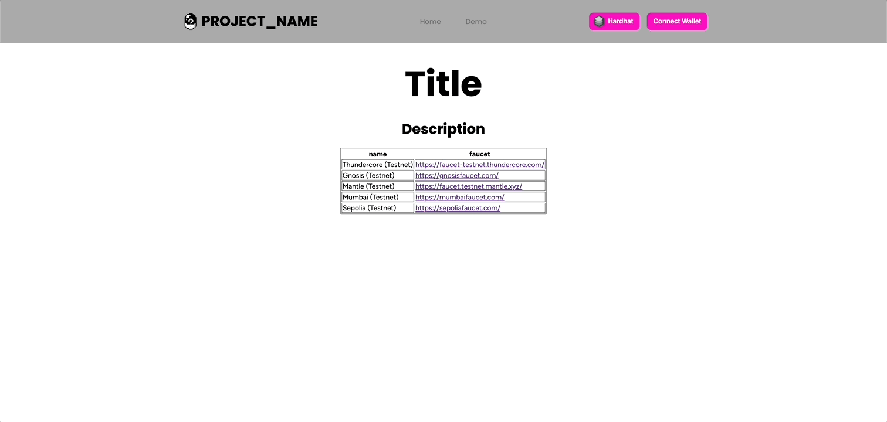

# argo-mono

## Project Structure

```txt
argo-mono/
├── README.md
├── packages
│   ├── art-engine: Art engine to create PFP ✅
│   ├── branding: Argo branding materials. Logos ❌
│   ├── apps: Whitelisting / Cron Jobs / Non-subgraph Indexing ❌
│   ├── constants: Deployed contract addresses, automatically updated when contracts are deployed ✅
│   │   ├── abis: Deployed Contract Abis
│   │   └── config: Deployed Contract addresses & start blocks by networks
│   ├── atlantis-ui: Argo atlantis frontend UI. ❌
│   ├── marketplace-ui: Argo marketplace frontend UI. ❌
│   ├── collector-page-ui: Argo collector page frontend UI. ❌
│   ├── argo-petz-ui: Argo atlantis frontend UI. ❌
│   ├── argo-atlantis: Argo atlantis smart contracts. ✅
│   ├── argo-petz: Argo petz smart contracts ✅
│   ├── subgraphs: Subgraphs for the argo protocol ✅
│   │   ├── hello_world: Subgraph that indexes TestContract.sol ✅
│   │   ├── atlantis: Subgraph for atlantis. ❌
│   │   ├── atlantis-marketplace: Subgraph for atlantis marketplace. ❌
│   │   └── argopetz: Subgraph for Argopetz ✅
│   ├── svelte-ui: Minimal svelte frontend to test the monorepo ✅
│   └── contracts: Minimal hardhat project to test the monorepo ✅
...
```


## Getting Started

### Requirements

1. pnpm: `npm install -g pnpm`
2. Docker [Mac](https://docs.docker.com/desktop/install/mac-install/) | [Windows](https://docs.docker.com/desktop/install/windows-install/) | [Linux](https://docs.docker.com/desktop/install/linux-install/)

### Install

`pnpm i`

### Run a minimal application

Run everything in the root directory

1. Set all of the .env files
2. Start the blockchain node `pnpm node`
3. Start the graph node `pnpm graph`
4. Deploy the diamondNFT subgraph `pnpm subgraph`
5. Start the frontend `pnpm dev:next`
6. View the frontend: <http://localhost:3000/demo>
7. Query the subgraph: [query](http://localhost:8000/subgraphs/name/argo/diamondsNFT/graphql?query=query+DiamondNFTs+%7B%0A++tokens+%7B%0A++++id%0A++++owner+%7B%0A++++++id%0A++++%7D%0A++%7D%0A%7D)

## Frontend example



## Commit Guide

1. Conventional commits
`feat/fix(scope): commit message`

2. Scopes
   1. repo: Changes to the mono-repo itself
   2. [package-name]: Changes to the specified package
      1. e.g. Change to the contracts package => `feat(contracts): add erc721 contract`

## Debugging

`ERRO the genesis block hash for chain ______ has changed from...`

`pnpm graph:reset` - deletes the ./data/postgres folder and restarts the graph node