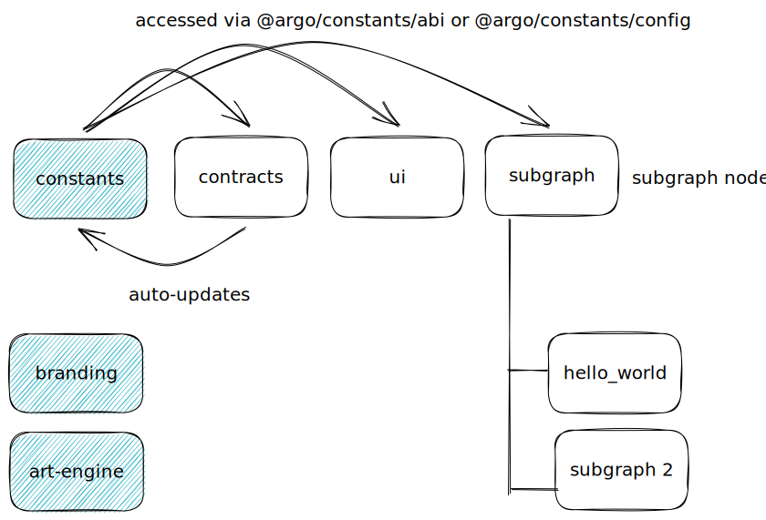

# argo-mono

## Project Structure

```txt
argo-mono/
├── README.md
├── packages
│   ├── art-engine: Art engine to create PFP ❌
│   ├── branding: Argo branding materials. Logos ❌
│   ├── apps: Whitelisting / Cron Jobs / Non-subgraph Indexing ❌
│   ├── constants: Deployed contract addresses, automatically updated when contracts are deployed ✅
│   │   ├── abis: Deployed Contract Abis
│   │   └── config: Deployed Contract addresses & start blocks by networks
│   ├── atlantis-ui: Argo atlantis frontend UI. ❌
│   ├── marketplace-ui: Argo marketplace frontend UI. ❌
│   ├── collector-page-ui: Argo collector page frontend UI. ❌
│   ├── argo-petz-ui: Argo atlantis frontend UI. ❌
│   ├── argo-atlantis: Argo atlantis smart contracts. ❌
│   ├── argo-petz: Argo petz smart contracts ❌
│   ├── subgraphs: Subgraphs for the argo protocol ✅
│   │   ├── hello_world: Subgraph that indexes TestContract.sol ✅
│   │   ├── atlantis: Subgraph for atlantis. ❌
│   │   ├── atlantis-marketplace: Subgraph for atlantis marketplace. ❌
│   │   └── argopetz: Subgraph for Argopetz ❌
│   ├── svelte-ui: Minimal svelte frontend to test the monorepo ✅
│   └── contracts: Minimal hardhat project to test the monorepo ✅
...
```



## Getting Started

### Requirements

1. pnpm: `npm install -g pnpm`
2. Docker [Mac](https://docs.docker.com/desktop/install/mac-install/) | [Windows](https://docs.docker.com/desktop/install/windows-install/) | [Linux](https://docs.docker.com/desktop/install/linux-install/)

### Install

`pnpm i`

### Run a minimal application

Run everything in the root directory

1. Start the blockchain node `pnpm node`
2. Start the subgraph node `pnpm subgraph`
3. Deploy the hello_world subgraph `deploy-subgraph:hello_world:local`
4. Start the frontend `pnpm dev`
5. View the frontend: <http://localhost:5173/>
6. Query the subgraph: <http://localhost:8000/subgraphs/name/argo/hello_world/graphql?query=query+User+%7B%0A++users+%7B%0A++++id%0A++++deposits+%7B%0A++++++id%0A++++++amount%0A++++%7D%0A++++withdrawals+%7B%0A++++++id%0A++++++amount%0A++++%7D%0A++%7D%0A%7D>